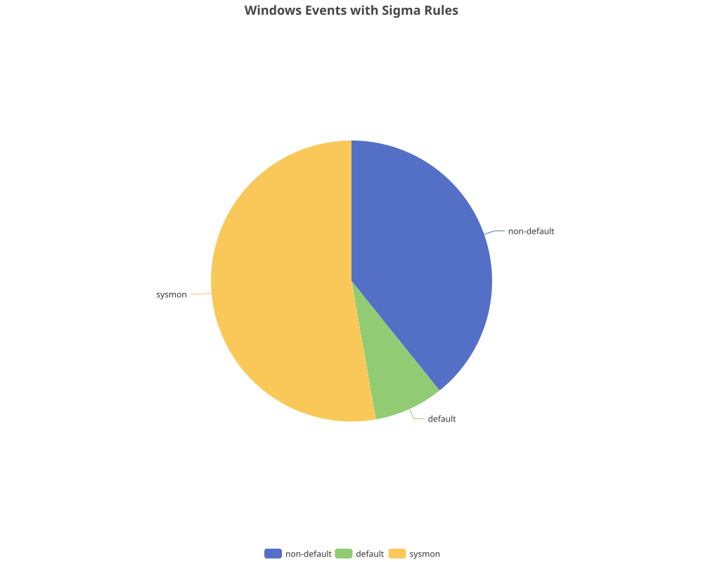
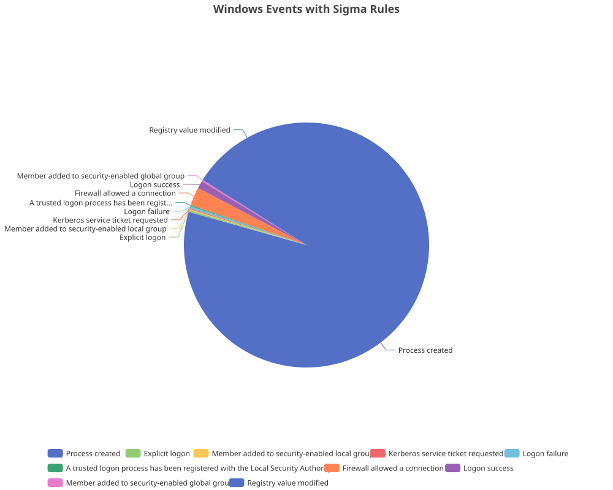

## Top Sigma log sources graph

## Top Sigma log sources table
| Category/Service | Channel/EventID | Count | Percentage | Rules | Source |
|------------------|-----------------|-------|------------|-------|--------|
| process_creation | Microsoft-Windows-Sysmon/Operational:1 Security:4688 | 2716 | 58.11% | 2716 | sysmon |
| registry_set | Microsoft-Windows-Sysmon/Operational:13 | 432 | 9.24% | 432 | sysmon |
| security | Security | 256 | 5.48% | 256 | default |
| file_event | Microsoft-Windows-Sysmon/Operational:11 | 211 | 4.51% | 211 | sysmon |
| ps_script | Microsoft-Windows-PowerShell/Operational,PowerShellCore/Operational:4104 | 187 | 4.00% | 187 | default |
| image_load | Microsoft-Windows-Sysmon/Operational:7 | 125 | 2.67% | 125 | sysmon |
| network_connection | Microsoft-Windows-Sysmon/Operational:3 Security:5156 | 104 | 2.23% | 104 | sysmon |
| system | System | 98 | 2.10% | 98 | default |
| registry_event | Microsoft-Windows-Sysmon/Operational:12,13,14 Security:4657 | 80 | 1.71% | 80 | sysmon |
| sysmon | Microsoft-Windows-Sysmon/Operational | 62 | 1.33% | 62 | sysmon |
| ps_module | Microsoft-Windows-PowerShell/Operational,PowerShellCore/Operational:4103 | 36 | 0.77% | 36 | sysmon |
| process_access | Microsoft-Windows-Sysmon/Operational:10 | 33 | 0.71% | 33 | sysmon |
| driver_load | Microsoft-Windows-Sysmon/Operational:6 | 32 | 0.68% | 32 | sysmon |
| application | Application | 31 | 0.66% | 31 | default |
| dns_query | Microsoft-Windows-Sysmon/Operational:22 | 26 | 0.56% | 26 | sysmon |
| windefend | Microsoft-Windows-Windows Defender/Operational | 21 | 0.45% | 21 | default |
| registry_add | Microsoft-Windows-Sysmon/Operational:12 Security:4657 | 20 | 0.43% | 20 | sysmon |
| pipe_created | Microsoft-Windows-Sysmon/Operational:17,18 | 20 | 0.43% | 20 | sysmon |
| create_remote_thread | Microsoft-Windows-Sysmon/Operational:8 | 16 | 0.34% | 16 | sysmon |
| file_delete | Microsoft-Windows-Sysmon/Operational:23,26 | 14 | 0.30% | 14 | sysmon |

## Top Security Event IDs graph

## Top Security Event IDs table
| EventId | Event | Count | Percentage |
|---------|-------|-------|------------|
| 4688 | Process created | 1317 | 78.02% |
| 4657 | Registry value modified | 266 | 15.76% |
| 5156 | Firewall allowed a connection | 40 | 2.37% |
| 4624 | Logon success | 17 | 1.01% |
| 4625 | Logon failure | 5 | 0.30% |
| 4648 | Explicit logon | 4 | 0.24% |
| 4728 | Member added to security-enabled global group | 3 | 0.18% |
| 4769 | Kerberos service ticket requested | 2 | 0.12% |
| 4611 | A trusted logon process has been registered with the Local Security Authority | 2 | 0.12% |
| 4720 | User account created | 2 | 0.12% |
| 4732 | Member added to security-enabled local group | 2 | 0.12% |
| 4634 | Account logoff | 2 | 0.12% |
| 5379 | Credential Manager credentials were read | 2 | 0.12% |
| 4768 | Kerberos authentication ticket (TGT) requested | 2 | 0.12% |
| 4699 | Scheduled task deleted | 1 | 0.06% |
| 4778 | Window station session reconnected | 1 | 0.06% |
| 1102 | Audit log cleared | 1 | 0.06% |
| 5136 | Directory service object modified | 1 | 0.06% |
| 6410 | Code integrity determined that a file does not meet the security requirements to load into a process | 1 | 0.06% |
| 4674 | Privileged object operation attempt | 1 | 0.06% |
