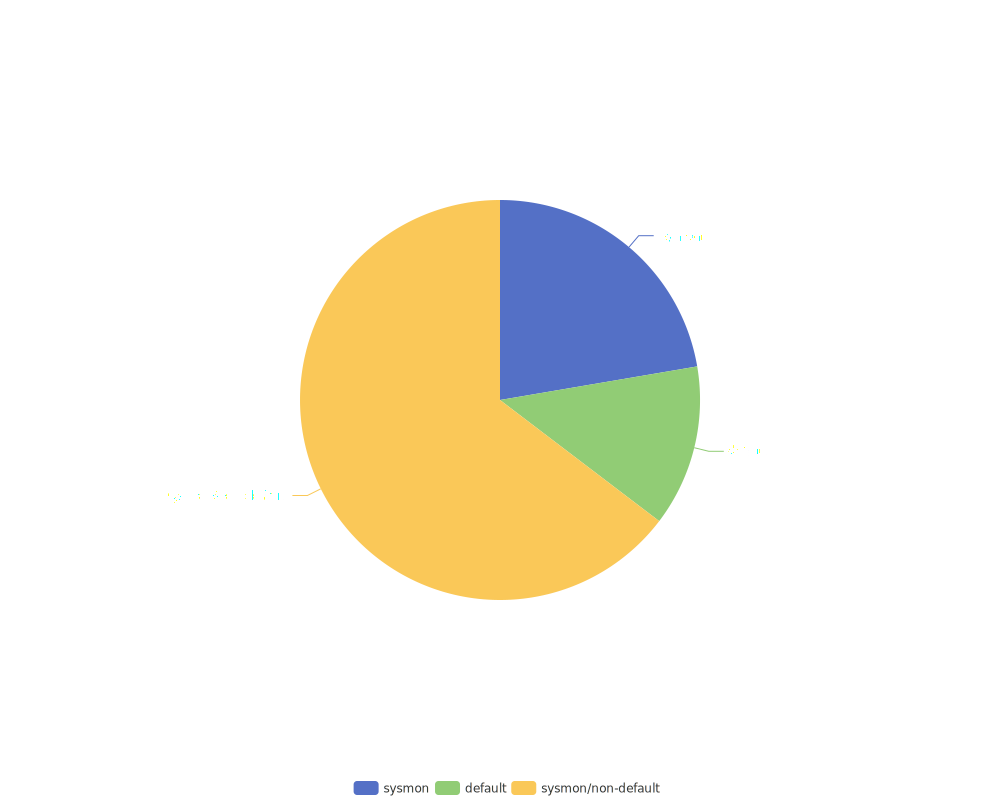
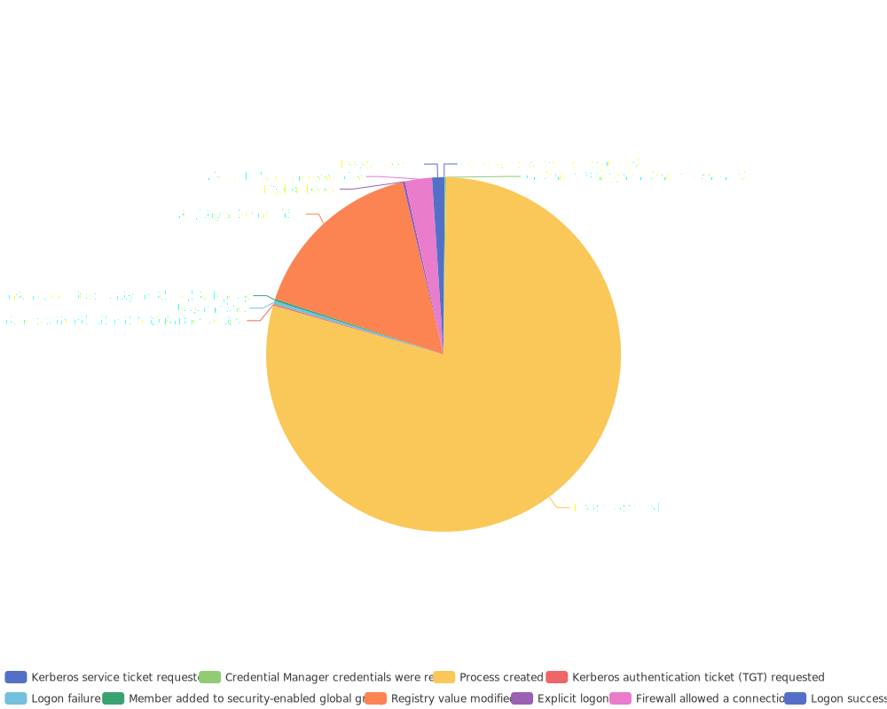

## Top Sigma log sources graph

## Top Sigma log sources table
| Category/Service | Channel/EventID | Count | Percentage | Rules | Source |
|------------------|-----------------|-------|------------|-------|--------|
| process_creation | Microsoft-Windows-Sysmon/Operational:1 Security:4688 | 2683 | 58.15% | 2683 | sysmon |
| registry_set | Microsoft-Windows-Sysmon/Operational:13 | 432 | 9.36% | 432 | sysmon |
| security | Security | 253 | 5.48% | 253 | default |
| file_event | Microsoft-Windows-Sysmon/Operational:11 | 209 | 4.53% | 209 | sysmon |
| ps_script | Microsoft-Windows-PowerShell/Operational,PowerShellCore/Operational:4104 | 184 | 3.99% | 184 | default |
| image_load | Microsoft-Windows-Sysmon/Operational:7 | 121 | 2.62% | 121 | sysmon |
| network_connection | Microsoft-Windows-Sysmon/Operational:3 Security:5156 | 104 | 2.25% | 104 | sysmon |
| system | System | 94 | 2.04% | 94 | default |
| registry_event | Microsoft-Windows-Sysmon/Operational:12,13,14 Security:4657 | 80 | 1.73% | 80 | sysmon |
| sysmon | Microsoft-Windows-Sysmon/Operational | 62 | 1.34% | 62 | sysmon |
| ps_module | Microsoft-Windows-PowerShell/Operational,PowerShellCore/Operational:4103 | 35 | 0.76% | 35 | sysmon |
| driver_load | Microsoft-Windows-Sysmon/Operational:6 | 32 | 0.69% | 32 | sysmon |
| process_access | Microsoft-Windows-Sysmon/Operational:10 | 32 | 0.69% | 32 | sysmon |
| application | Application | 30 | 0.65% | 30 | default |
| dns_query | Microsoft-Windows-Sysmon/Operational:22 | 24 | 0.52% | 24 | sysmon |
| windefend | Microsoft-Windows-Windows Defender/Operational | 21 | 0.46% | 21 | default |
| pipe_created | Microsoft-Windows-Sysmon/Operational:17,18 | 20 | 0.43% | 20 | sysmon |
| registry_add | Microsoft-Windows-Sysmon/Operational:12 Security:4657 | 20 | 0.43% | 20 | sysmon |
| create_remote_thread | Microsoft-Windows-Sysmon/Operational:8 | 16 | 0.35% | 16 | sysmon |
| file_delete | Microsoft-Windows-Sysmon/Operational:23,26 | 14 | 0.30% | 14 | sysmon |

## Top Security Event IDs graph

## Top Security Event IDs table
| EventId | Event | Count | Percentage |
|---------|-------|-------|------------|
| 4688 | Process created | 1301 | 77.86% |
| 4657 | Registry value modified | 266 | 15.92% |
| 5156 | Firewall allowed a connection | 40 | 2.39% |
| 4624 | Logon success | 17 | 1.02% |
| 4625 | Logon failure | 5 | 0.30% |
| 4648 | Explicit logon | 4 | 0.24% |
| 4728 | Member added to security-enabled global group | 3 | 0.18% |
| 5379 | Credential Manager credentials were read | 2 | 0.12% |
| 4769 | Kerberos service ticket requested | 2 | 0.12% |
| 4768 | Kerberos authentication ticket (TGT) requested | 2 | 0.12% |
| 4732 | Member added to security-enabled local group | 2 | 0.12% |
| 4611 | A trusted logon process has been registered with the Local Security Authority | 2 | 0.12% |
| 4634 | Account logoff | 2 | 0.12% |
| 4720 | User account created | 2 | 0.12% |
| 4672 | Admin logon | 1 | 0.06% |
| 4699 | Scheduled task deleted | 1 | 0.06% |
| 4825 | RDP logon failed | 1 | 0.06% |
| 4778 | Window station session reconnected | 1 | 0.06% |
| 4697 | Service installed | 1 | 0.06% |
| 4647 | User initiated logoff | 1 | 0.06% |
